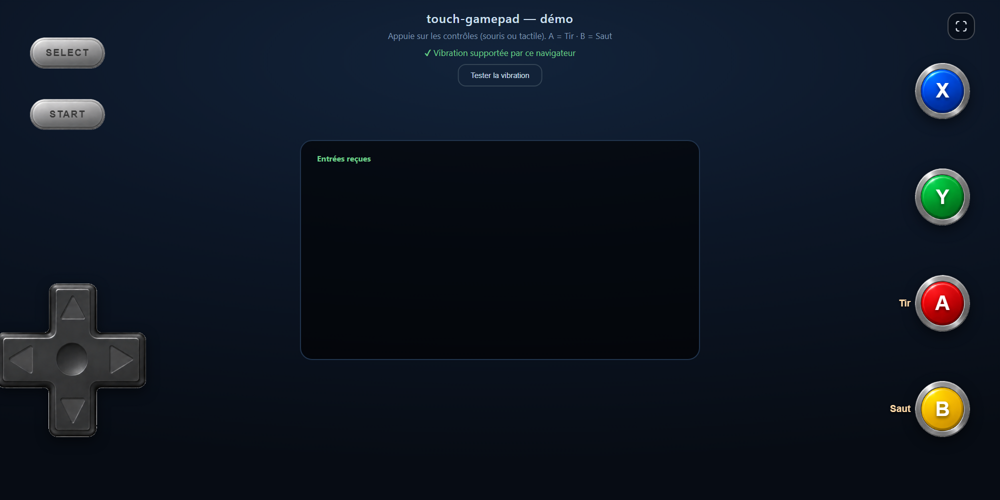

# touch-gamepad

Overlay de **contrôles tactiles** (croix directionnelle + boutons style manette 90s) pour
jeux web en paysage. **Zéro dépendance, sans build** — JavaScript vanilla (ES module) + CSS.



> **Démo en ligne : [billshop.github.io/touch-gamepad](https://billshop.github.io/touch-gamepad/)** — à ouvrir sur mobile en paysage.

Par défaut, chaque contrôle **synthétise l'événement clavier** correspondant : un jeu déjà
piloté au clavier devient jouable au tactile **sans modifier sa logique**.

La croix se pilote **au glissé** (le doigt passe d'une direction à l'autre sans relâcher)
et gère les **diagonales**. Tout est **multi-touch** : plusieurs doigts simultanés
(ex. une diagonale + deux boutons d'action) fonctionnent indépendamment.

## Aperçu

```
python serve.py         # puis ouvrir http://localhost:8000 (mode paysage)
```

La démo (`index.html`) affiche la manette et journalise en direct les entrées reçues
ainsi que les événements clavier synthétisés.

### Mini-jeu : la preuve du « drop-in clavier »

[`examples/collect.html`](examples/collect.html) ([en ligne](https://billshop.github.io/touch-gamepad/examples/collect.html))
est un petit jeu qui **n'écoute que le clavier** (`keydown`/`keyup`, zéro code tactile) :
on déplace un pion aux flèches (diagonales comprises) et `A` déclenche un dash. On monte
simplement `touch-gamepad` par-dessus, et le jeu devient jouable au doigt **sans qu'une
seule ligne de sa logique ne change**.

## Utilisation

```html
<link rel="stylesheet" href="./src/touch-gamepad.css">
<script type="module">
  import { createTouchGamepad } from './src/touch-gamepad.js';

  const pad = createTouchGamepad({
    mapping: { A: 'Space', B: 'ArrowUp', X: null, Y: null }, // codes clavier (KeyboardEvent.code)
    labels:  { A: 'Tir', B: 'Saut' },                        // libellés d'action optionnels
    onlyOnTouch: true,     // n'afficher que sur écran tactile
  });
  // pad.setVisible(false); pad.destroy();
</script>
```

La croix (`up/down/left/right`) est mappée par défaut sur les flèches ; `select`/`start`
sur `ShiftLeft`/`Enter`. Tout est surchargeable via `mapping`.

## Options

| Option | Défaut | Rôle |
|---|---|---|
| `mount` | `document.body` | élément hôte de l'overlay |
| `assetsPath` | `../assets/` | dossier des PNG de boutons |
| `mapping` | flèches + A=Space | code clavier par contrôle (ou `null` = inactif) |
| `labels` | `{}` | libellé d'action affiché près d'un bouton |
| `onlyOnTouch` | `true` | masquer sur desktop |
| `synthesizeKeyboard` | `true` | émettre `keydown`/`keyup` |
| `keyTarget` | `window` | cible des événements clavier |
| `onInput` | `null` | callback `(name, pressed)` |
| `dpadDeadzone` | `0.22` | rayon mort au centre de la croix (fraction du rayon) |
| `allowDiagonals` | `true` | autoriser deux directions simultanées sur la croix |
| `dpadDiagonalWidth` | `30` | largeur d'un coin diagonal en degrés (plus petit = directions pures plus larges) |
| `vibrate` | `20` | durée de vibration au toucher en ms (`0`/`false` pour désactiver) |
| `fullscreenButton` | `true` | afficher le bouton plein écran (coin haut-droit) |
| `lockScroll` | `true` | neutraliser pull-to-refresh + scroll/zoom de la page tant que monté |

Retour : `{ el, setVisible(v), toggleFullscreen(), destroy() }`.

Le bouton **plein écran** (coin haut-droit) passe l'hôte en `requestFullscreen()` et tente
de **verrouiller l'orientation en paysage** (`screen.orientation.lock`, quand le navigateur
le permet). La méthode `toggleFullscreen()` fait la même chose par programmation.

## Contrôles fournis

Croix directionnelle (glissé + diagonales) · 4 boutons d'action **X / Y / A / B** ·
**SELECT** / **START**. Le layout (positions/tailles) vit dans `src/touch-gamepad.css` —
réglé pour un jeu paysage plein écran, à surcharger selon le projet.

## Structure

```
index.html              démo + banc d'essai
examples/collect.html   mini-jeu clavier + manette (preuve du drop-in)
src/touch-gamepad.js    la librairie
src/touch-gamepad.css   styles / layout par défaut
assets/                 boutons (croix, X/Y/A/B, pastille) + capture
serve.py                serveur de dev no-cache (optionnel)
```

## Licence

[MIT](LICENSE) © 2026 BillShop.
